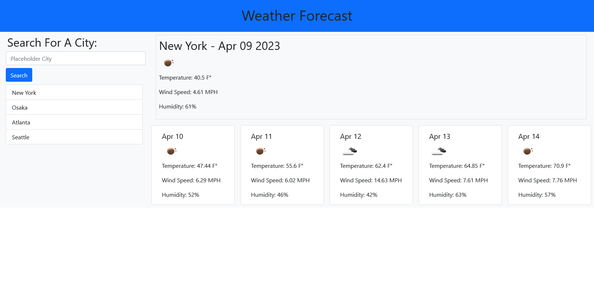

# Weather Forecast

## Description
This project was to make a weather forecast website utilizing some pre-determined APIs. You search for a city name in the input field, and it automatically retrieves the current weather and 5-day forecast for that city and displays it on the page. It does it by turning the city name into coordinates via the OpenWeather Geocoder API, then feeding those into the OpenWeather Current Weather and 5-Day Forecast APIs, respectively. It will also add the searched city to a search history that can also be used to view older searches easily with a click. I also added a fuction that automatically places a random city name in the input field for cosmetic purposes.

I found this project seemingly very difficult at first since I found networking and API request to be very daunting, but the great documentation at OpenWeather and the bootcamp materials helped quite a lot. I definitely learned how to properly request data, and use it in the right way. I initially ran into multiple issues with data being inaccesible outside the relevant fetches, and solving that helped my learning a great deal. I also found what I believe to be an error in the OpenWeather API and contacted them about it. When given a certain city name, it retrieves the correct coordinates, but then the following APIs return back a different name for the same coordinates.

## Credits
This project would obviously not be possible without the OpenWeather APIs. In this project, I used three: the 5-Day Weather Forecast, Current Weather, and Geocoder. It also would be impossible without the documentation for those APIs. A link to OpenWeather's APIs can be found [here.](https://openweathermap.org/api)

I also need to credit the MDN documentation for helping me with learning fetch(), and other minor hiccups with my JavaScript.

## Website Link
The finished website can be found [here!](https://alecryanhunter.github.io/Weather-Forecast/)

## Screenshots
